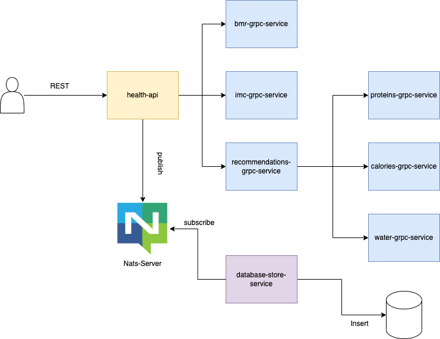
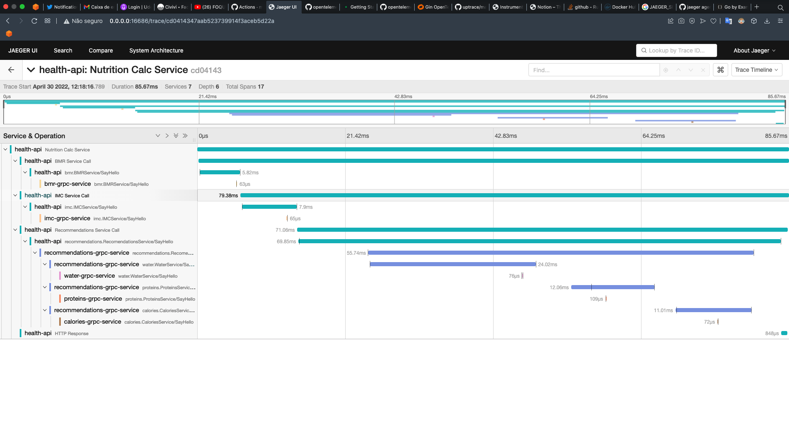
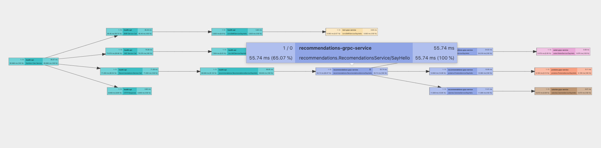

# Nutrition Overengineering
Application to calc healthcare and nutrition metrics, but using the most over engineered as possible

> "Caraca Matheus, tu é idiota??? 
> "Sim"


# Overenginner Microservices Summary

* `health-api`: REST Interface for product. Using orchestrator pattern. 
* `bmr-grpc`: gRPC Microservice to calc Basal Metabolic Rate
* `imc-grpc`: gRPC Microservice to calc IMC 
* `recommendations-grpc`: gRPC Microservice to summarize diet recommendations and contabilize Macros
* `proteins-grpc`: gRPC Microservice to calc daily protein necessity
* `water-grpc`: gRPC Microservice to calc daily water ingestion
* `calories-grpc`: gRPC to calc calories ingestion necessity
* `frontend`: VueJS SPA

## Docker Images

| Application                   | Image                                             | 
|-------------------------------|---------------------------------------------------|
| health-api                    | fidelissauro/health-api:latest                    |
| bmr-grpc-service              | fidelissauro/bmr-grpc-service:latest              |
| imc-grpc-service              | fidelissauro/imc-grpc-service:latest              |
| water-grpc-service            | fidelissauro/water-grpc-service:latest            |
| calories-grpc-service         | fidelissauro/calories-grpc-service:latest         |
| proteins-grpc-service         | fidelissauro/proteins-grpc-service:latest         |
| recommendations-grpc-service  | fidelissauro/recommendations-grpc-service:latest  | 
| database-store-service        | fidelissauro/database-store-service:latest        | 


## Workflow 



# API  

## Usage 

```bash
curl --location --request POST '0.0.0.0:8080/calculator' \
--header 'Content-Type: application/json' \
--data-raw '{ 
   "age": 26,
   "weight": 90.0,
   "height": 1.77,
   "gender": "M", 
   "activity_intensity": "very_active"
} ' --silent | jq .
```

```json
{
    "status": 200,
    "imc": {
        "result": 28.72737719046251,
        "class": "overweight"
    },
    "basal": {
        "bmr": {
            "value": 2011.7,
            "unit": "kcal"
        },
        "necessity": {
            "value": 3470.1825000000003,
            "unit": "kcal"
        }
    },
    "health_info": {
        "age": 26,
        "weight": 90,
        "height": 1.77,
        "gender": "M",
        "activity_intensity": "very_active"
    },
    "recomendations": {
        "protein": {
            "value": 180,
            "unit": "g"
        },
        "water": {
            "value": 3150,
            "unit": "ml"
        },
        "calories": {
            "maintain_weight": {
                "value": 3470.1825000000003,
                "unit": "kcal"
            },
            "loss_weight": {
                "value": 3123.1642500000003,
                "unit": "kcal"
            },
            "gain_weight": {
                "value": 5205.27375,
                "unit": "kcal"
            }
        }
    }
}
```

# Jaeger

## Using Tracing between services 

To use jaeger tracing you can specify environment variable called `JAEGER_COLLECTOR_ENDPOINT`. 

```bash
export JAEGER_COLLECTOR_ENDPOINT=http://jaeger:14268/api/traces
```






# TODO
* Refactor communication lib 
* Customize log lib for trace id
* Error Handling and Retries
* Implement Prometheus HTTP Endpoint
* Create Kubernetes Deployment
* Create Istio Manifests to Service Mesh gRPC Optimizations

## Notes 

```
brew install grpc protobuf protoc-gen-go-grpc
protoc --proto_path=proto/bmr --go_out=proto/bmr --go_out=plugins=grpc:bmr --go_opt=paths=source_relative proto/bmr/bmr.proto
protoc --go_out=plugins=grpc:bmr bmr.proto
```